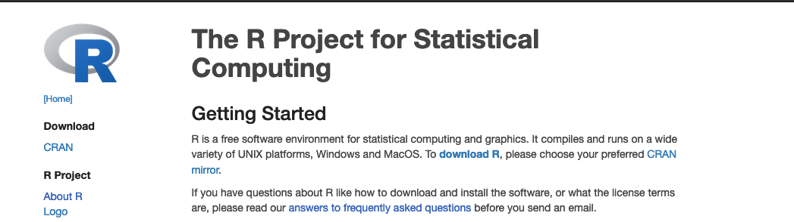
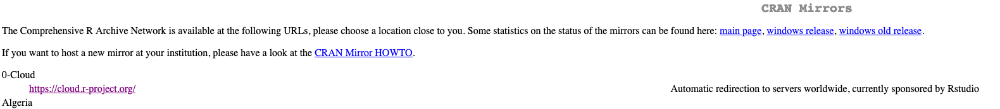
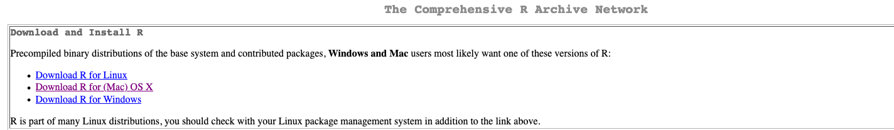
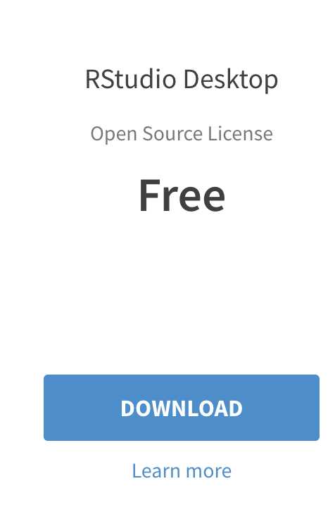
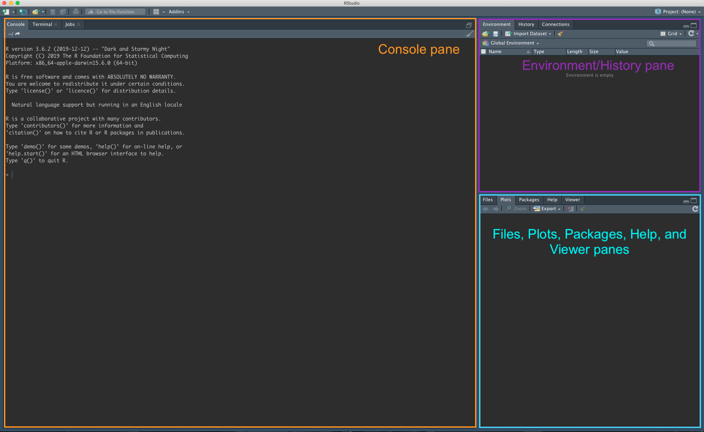
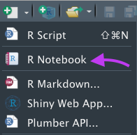

# Software for class {#software}

```{block, type='objectives'}

**Objectives:**

1. To familiarize ourselves with the main software used in class
2. To install programs used for basic computational biology
3. To perform basic tests of functionality of these programs
```

As I mentioned in the previous chapter, we are going to use *R, RStudio* and the basic *UNIX command line* for our exercises, as well to view and edit files.

*For this course we WON'T need to install R or RStudio on our computers! We will use a webpage that has R and RStudio*. That being said, I'll leave this guide in case you want to install it in the future.

## How to install R?

1. Open an internet browser and go to [www.r-project.org](www.r-project.org)

2. Click the "download R" link in the middle of the page.



3. Select a CRAN location (a mirror site) and click the corresponding link.  



4. Click on the "Download R for" link that matches your operating system, at the top of the page.


        
5. 
  - For Windows users: Click on the "install R for the first time" link at the top of the page. Run the `.exe` file and follow the installation instructions.  
  - For MacOS X users: Click on the "R-4.0.2.pkg" link to download the install package. Run the `.pkg` file and follow the installation instructions.  

## How to install RStudio?

1. Go to [www.rstudio.com](www.rstudio.com) and click on the "Download" link.


2. Click on "Download RStudio Desktop (FREE)" in the lower part of the page.



3. Click on the version recommended for your system. save the .exe/.dmg file on your computer, double-click it to open, and then drag and drop it to your applications folder.

***

# Testing the software

## Testing R and RStudio

1.  Go to http://140.232.222.14:8787

2. Log in using your Clark username *without* the `@clarku.edu` (e.g. my user would be `jtabima`) and the `BIOL123` password, all in capital letters

3. You should see a window like this:



Welcome to SMAUG! This is our processing machine for BIOL123.

You should have three panes open (or probably four). The one on the left that says `R version XXX` is your *console*. Most of the code goes there, both input and output. 

On the upper right you have the *environment/history* pane. The environment stores and shows you all the files being used by the current R session that are saved in your RAM. We will rarely use the environment in this course, but it's still an important feature to know how much memory is being used, how many files are loaded and if our objects are actually being used by R. The history panel will show you all the previously used code.

Finally, the lower right has the *Files, Plots, Packages, Help, and Viewer panes*. These panes show exactly that: The files in the folder you are in, the plots generated by R, the R packages that will be loaded, and the help for the different R packages. The Viewer panel is a special feature that is used by some packages, we will use it later.

4. Now, you will see the menu in the top. Click on the `new file` element and let's do our first R notebook.

5. Click on `new file`, and then `R notebook`



We will talk on class about R notebooks and why they are important for our course!


## Testing the editing features of R Studio

1. To test the text editor in R studio, download the `Test for editor` file from the [Canvas page](https://canvas.clarku.edu/courses/21486/modules/items/879290)

2.Upload the file into your R studio server instance at SMAUG using hte 

3. Use `File -> Open` and open `atom_test`

4. You should be able to read a text file!

We will use RStudio to open more of these kinds of files that have no programs associated with them! RStudio can open any text file that is un-formatted, as well as many scripts and programs. We won't go so deep into these other elements (Remember, this is an *Introduction* course!) but we can discuss them in the lab.

