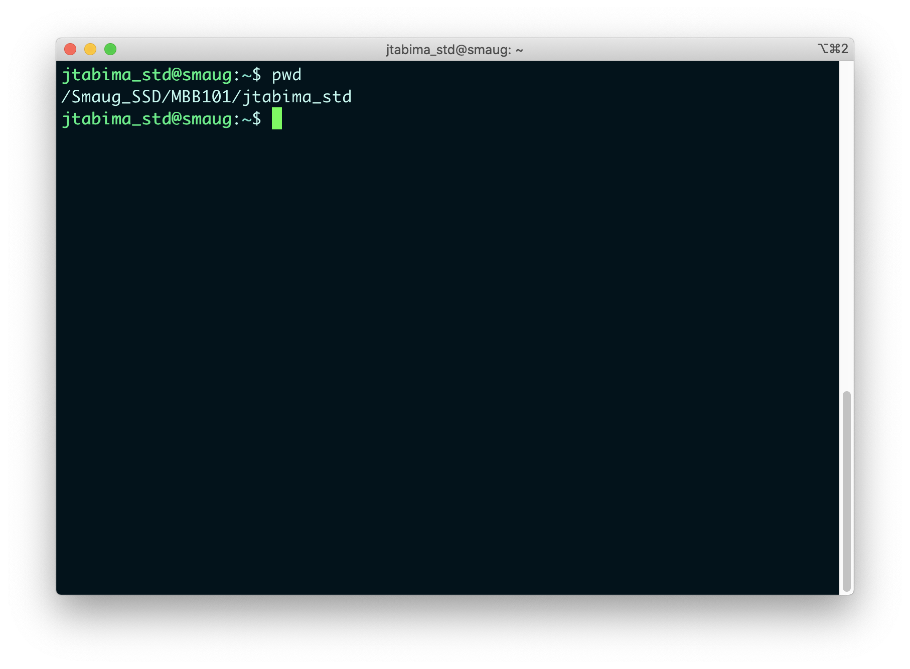
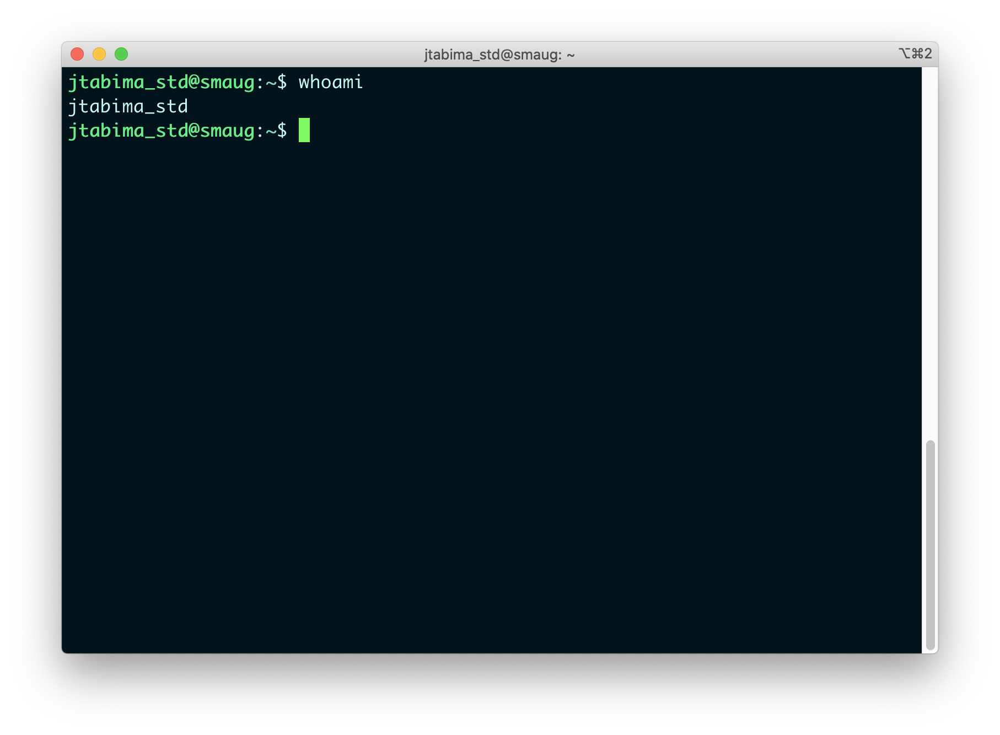
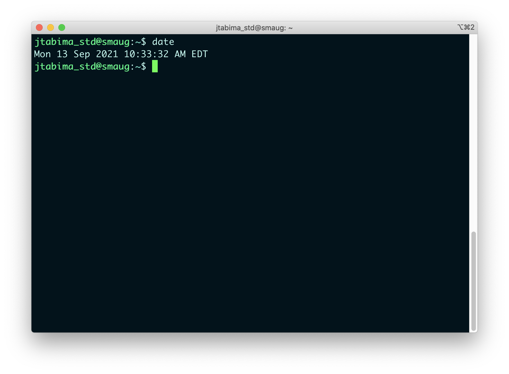
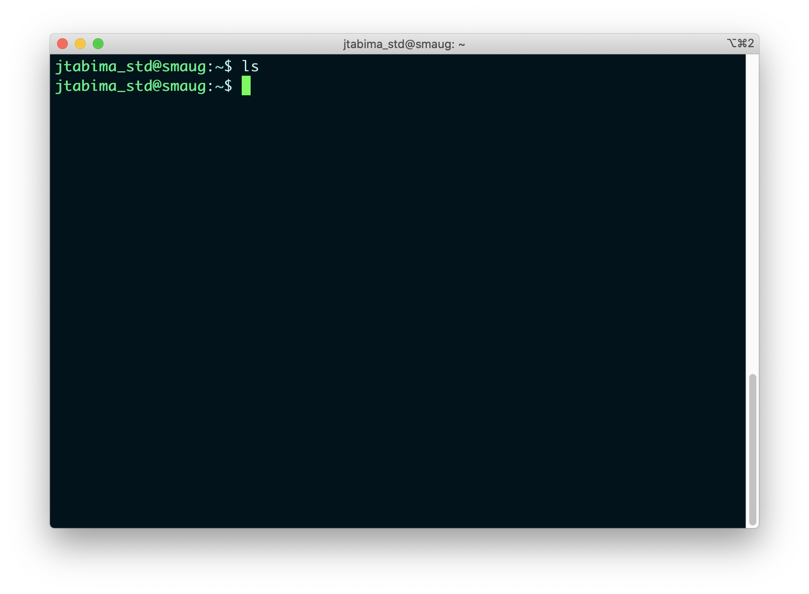
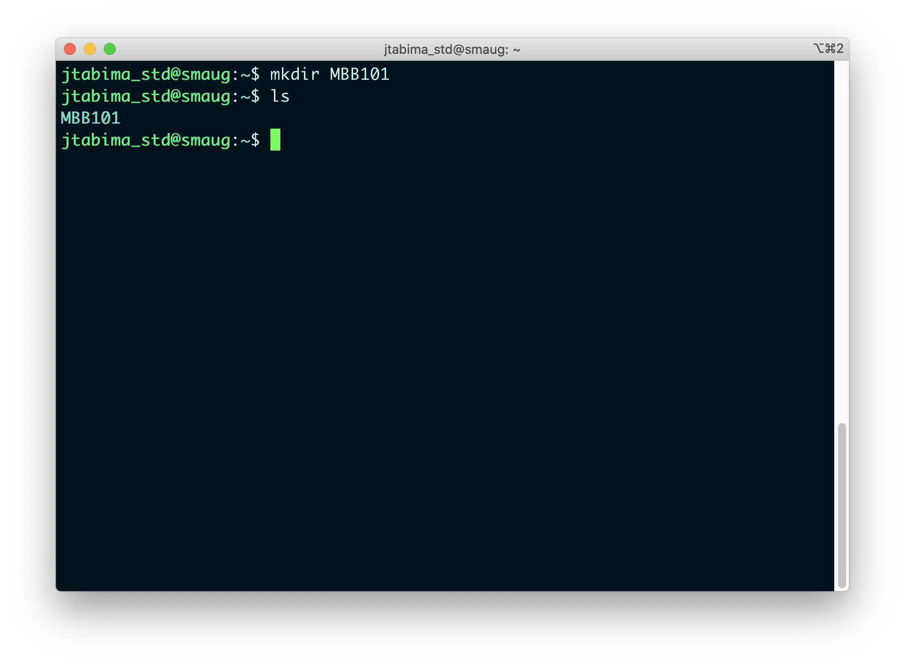
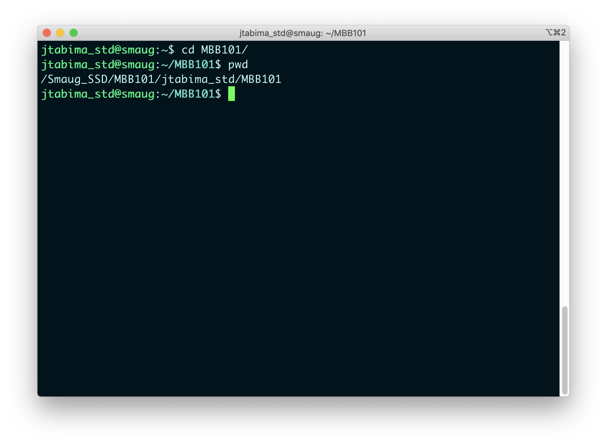
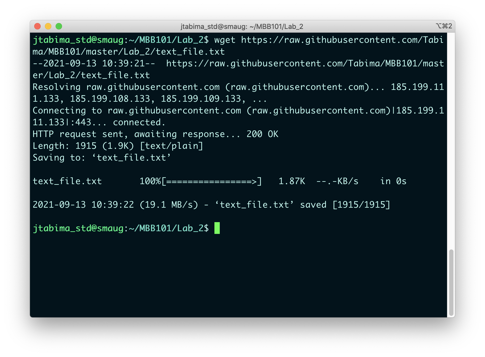
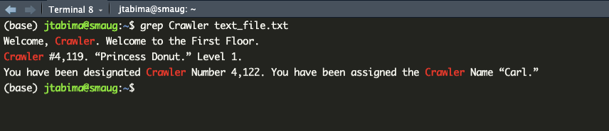
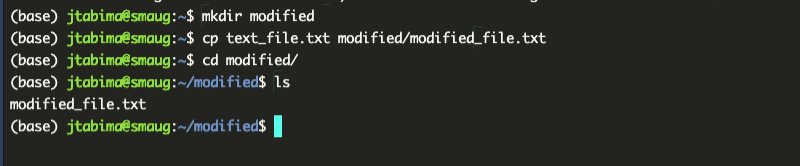

# Introduction to the Command Line

```{block, type='objectives'}

### Objectives:

1. To start using the command line for basic coding
2. To learn how to navigate in the command line
3. To create our first lines of code to process text files
```

The UNIX command line is a program that will interpret commands, in the form of text instructions, for the computer to be executed.

This means that you can tell the computer to `list files` or `print text in the screen` or `do a mathematical operation` using a set of commands and the computer will execute them and provide you with an answer.

However, before we start using the command line I decided to make a list of the most commonly used commands in UNIX for your future reference.

***

## Commonly used commands

### Logging in

- Logging into the cluster: `140.232.222.14:8787` in your browser

### Navigating the cluster

- Show your current working directory: `pwd`
- Navigating into a folder: `cd foldername`
- Creating a folder: `mkdir foldername`
- Visualizing the contents of a folder: `ls`
- Creating a symbolic link `ln -s source destination`
- Visualizing a file: `less file` or `cat file`

### Moving and downloading files

- Copying a file: `cp file destination`
- Renaming a file/Moving a file: `mv file destination_or_new_name`
- Downloading a file: `wget web_address_of_the_file`
- Removing a file `rm file`

### Editing files

- Edit a text file: `nano` (However, we will try to use Atom for now)
- Counting the number of lines, words and bytes of a file: `wc`
- Match a pattern and extract text: `grep pattern_of_interest`
- Match and replace a pattern in a text file: `sed 's/match/replacement/g'`

***

## Section 1: Basics of the command line 

Today, we will do very basic things on the cluster. First, we will learn about our whereabouts (where is our `home` folder), then we will learn how to `create a folder` for the lab within your home folder. Then, we will create a folder for lab 2 and download a file to it. Finally, we will do a similar exercise to the one in class, and count the number of occurrences in a text file.

### Logging into the cluster.

1. Log into your RStudio session through your browser as indicated above
2. Go to the `Terminal` tab in the Command Pane Viewer in the bottom of your screen

> WELCOME TO SMAUG!!

### Where are we? Who am I?

First thing: you land in the magical realm of the cluster. Now... where are you?

```{block, type='rmdquestion'}
### Question 1

- What command would you use to check which working directory you are in?
```





In addition, in case you forget what is your username, you can always use the command `whoami`:



This means two things:

1. Our home directory, where all of your files are, is located within the `/Smaug_SSD/BIOL123_2026/username` folder
2. Our username, in case we forget it, can always be remembered.

### Running basic commands

So, the idea of the command line is to run commands, right?
Well, congrats! You have already ran two commands! 

```{block, type='rmdquestion'}
### Question 2

- Which commands have you already ran?
``` 

So, as you know now. To run commands you just write them and that's it! 

For example: you want to know what time it is? Use the command `date`:



We will learn to use more commands as we use the cluster more and more.


### Creating files and navigating through the cluster

In order to follow the structure of the reproducibility class, we will create folders for each lab session and store the files in them. 

1. Before we start, see if you have any folders in your `home` folder. Check that with the `ls` command:



If you see nothing new, then that means you have nothing in that folder. That's good!

2. For today's lab let's create a folder called `MBB101`.

```{block, type='rmdquestion'}
### Question 3

- Using the command list above, what command would you use to create a folder?
```

Exactly, so use that command to create the folder, and then use the `ls` command to check if the folder was correctly created (`ls` is short for list, as it lists all of the files within a folder):



Nice, the folder has been created! 

To navigate into the new BIOL123 folder, use the `cd` command (`cd` is short for change directory).

The syntax of `cd` is `cd destination`, so in our case, we would do `cd BIOL123`:



if you see, after our `username@smaug` we can see now it shows a prompt that says `BIOL123`. This means we have been able to move to our folder! 

You can also check if you are inside the folder of interest by using the `pwd` command (`pwd` is short for print working directory)

```{block, type='rmdquestion'}
### Question 4

- Create a folder within BIOL123 called Lab_2. How would you do it? Add a screenshot of the command and the result.
```


> Good job! Nicely done at creating your first folder!

### Downloading files into the cluster.

After creating your `Lab_2` folder, we need to populate it with files.

I have created a file for us to do a quick and fun exercise today and have uploaded it to a public repository of files called GitHub, at this link: `https://raw.githubusercontent.com/Tabima/BIOL123/master/Lab_2/text_file.txt`. 

To download the files, use the `wget` command. (`wget` is short for web page get): 



```{block, type='rmdquestion'}
### Question 5

- What are the contents of this file? What command from the list above would you use to open or view a file?
```

```{block, type='rmdquestion'}
### Question 6

- How many lines does this file have? What command from the list above would you use to count the number of lines? What are the three outputs from the command?
``` 

***

### Extracting patterns from a text file

Finally, let's do the examples from Monday's course:

* How many times is the word "Crawler" found in the document?
* How many times is the cat mentioned?
* How much time was left in the count-down timer ?

To find and match a pattern, we can use the command `grep`. (`grep` is short for `g/re/p`: globally search for a regular expression and print matching lines)

So, if we want to find out if the word "Crawler" is mentioned in the document we use the command:

`grep Crawler text_file.txt`

```{block, type='rmdwarning'}

**NOTE: Before you run the command, do you see anything weird?**

In this case, we are using two more arguments after the `grep` command: The pattern of interest we want (Crawler) and the file that we want to search in (text_file.txt).

To learn how to use these commands, we can google the command or use the `man` command (short for manual). 
```

Alright, what does the output of `grep` look like?



Ah cool, we can see if the pattern is present or not!


```{block, type='rmdquestion'}
### Question 7

- What happens if you try to answer these questions using `grep`? 

* How many times is the word "Crawler" found in the document?
* How many times is the cat mentioned?
* How much time was left in the count-down timer?

Summarize how `grep` can help you with finding these patterns of interest.
```

```{block, type='rmdquestion'}
### Question 8

- Using the `man grep` command, how can you use grep to count the number of occurrences of a text string? For example, can grep count the number of times the word `Crawler` exists in the file? Write the command you would use and the results.
```

***

## Section 2: Advanced command line.

### Identifying paths

We know now how to download and check files, but we also need to remember how to look at where the files are in case we need to use paths in the future.

For example, what is the path of the `text_file.txt` we were working on?


```{block, type='rmdquestion'}
### Question 9

- Using the `readlink -f` command, can you indicate what the full path of this file is?
```

```{block, type='rmdquestion'}
### Question 10

- If you are in your home (`~`) folder, and you have a file there called `file.txt`, what is the relative path of this file?
```

### Creating copies of a file into a new folder.

We want to modify the `text_file.txt` to add, remove, replace or count elements in a new version of it. 

So, the idea is to create a new folder inside your `Lab_2/` folder, named `modified/`.

Create the folder and copy the `text_file.txt` file into a new file called `modified_file.txt` in a new folder called `modified/` using the `cp` command.


```{block, type='rmdquestion'}
### Question 11

- Please present syntax of the command to do the instructions above.
```

```{block, type='rmdquestion'}
### Question 12

- What is the absolute path of the `modified_file.txt`?
```

Let's check if it worked:



***

### Replacing patterns using `sed`

So, if you recall the theory class, we learned about the `sed` command to replace patterns. 

The idea is that you will replace some patterns in the `modified_file.txt` file and then check if the results make sense.

1. Change the `Donut` patterns to `Javier` and save the file as `new_cat.txt` using the `sed s/Donut/Javier/g modified_file.txt > new_cat.txt` command.


```{block, type='rmdquestion'}
### Question 13

- What does the `>` in the command mean?
```

```{block, type='rmdquestion'}
### Question 14

- Check the number of occurrences of the word `Donut` in the `new_cat.txt` file using `grep`. 
```

```{block, type='rmdquestion'}
### Question 15

- How many times does the word `Donut` appear? Is it the same number as in question 7 when you checked the number of times that Harry was mentioned? Why?
```

```{block, type='rmdquestion'}
### Question 16

Count the number of lines of the `new_cat.txt` file and compare them to the original file.

- Is the number of lines similar between `new_cat.txt` and `modified_file.txt`? Very briefly justify your answer.
```


4. Extract all the lines that say `Javier` from `new_cat.txt` into a new file called `Javier_lines.txt`. 

```{block, type='rmdquestion'}
### Question 17

- Present the syntax to execute the previous instruction.
```

```{block, type='rmdquestion'}
### Question 18

- What are the number of lines that say `Javier` in the file? Is the number different from questions 14 and 15? Explain your answer very briefly.
```

***

### Removing files, renaming files and creating symbolic links

Now that we are done creating files and modifying them, we need to remove all the files we are not using anymore. The `rm` command will allow us to do that.

1. Remove the `potter_lines.txt` and the `modified_file.txt` files from the folder. 

```{block, type='rmdquestion'}
### Question 19

- What are the commands you used to remove the files? How can you make sure the files do not exist anymore?
```


2. Rename the `new_cat.txt` file as `javier_cat.txt` using the `mv` command, as such: `mv new_cat.txt javier_cat.txt`.

```{block, type='rmdquestion'}
### Question 20

- Explain the syntax of the previous command briefly.
```


3. Go back to your `Lab_2/` folder (remember to use the `cd ..` command) and create a symbolic link of your `Potter_story.txt` file into the `Lab_2/` folder using the `ln -s modified/javier_cat.txt .`. 

```{block, type='rmdquestion'}
### Question 21

- Explain the syntax of the previous command briefly.
```

```{block, type='rmdquestion'}
### Question 22

- Use the ls -l command while in your `Lab_2/` folder. What is a weird pattern you see on the new `javier_cat.txt` file? Is that its absolute or its relative path?
```
