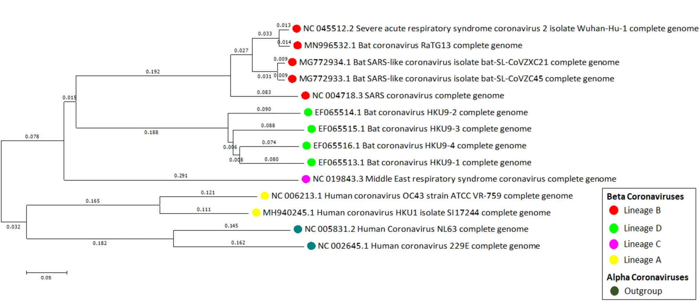

# Advanced Bioinformatics

```{block, type='objectives'}

**Objectives:**

1. **Section 1** will focus on how to identify open reading frames and a gene based on searches on the ORF finder, translate the largest ORF and navigate through NCBI as we did on the theory class
2. **Section 2** will focus on how to use the cluster to create a BLAST and HMMER database of genes of interest.

```

***

## Section 1: Open reading frames, translating sequences and BLAST searches to identify the role and functionality of a mystery gene


1. Download the `mystery_gene.fasta` file and open it on `R`. This is a nucleotide strand from a segment of a chromosome of a cool species that we will try to identify.

2. Go to [NCBI's ORF Finder](https://www.ncbi.nlm.nih.gov/orffinder/) and upload your sequence by copying and pasting it. Keep the parameters by default and submit the form. Answer the following questions:

***

```{block, type='rmdquestion'}
### Questions 1 - 5

-  How many ORFs do you find in the sequence?
-  Which ORF is the longest, how long it is (Both in NT and AA), and in which strand (Plus or minus) is located?
-  In what frame is the longest ORF? What does this mean?
-  Click on Display ORF and copy and paste the Protein sequence and the nucleotide sequence of the longest ORF here
-  Is there any ORF in the reverse direction? (-)
```


3. Now, take your original sequence and go to [NCBI BLAST ](https://blast.ncbi.nlm.nih.gov/Blast.cgi). Answer the following question:


```{block, type='rmdquestion'}
### Question 6

-  This is DNA data, so what kinds of BLAST can you use? 
```

4. First, let's do a nucleotide BLAST. Click on nucleotide BLAST, and copy and paste your original sequence. Now, select the **Nucleotide collection** database and run a megablast. Answer the following questions:

```{block, type='rmdquestion'}
### Questions 7-8

-  What are the best 3 hits? Why do you consider them the best hits?
-  Include the accession numbers of the best three hits.
```

5. Go to the Graphic Summary of the BLAST results. Take a screenshot and add it below and answer the following questions

```{block, type='rmdquestion'}
### Question 9

-  Does this graphic summary support your results from question 7? Explain why briefly.
```

6. Go to the Taxonomy window of the BLAST results. Answer the following question:


```{block, type='rmdquestion'}
### Question 10
-  What species has the highest score? What about the other species? Are they closely related to each other?
```

7. After doing the BLAST, click on the hit with the best score. You should find the accession number there (AY190508.1). Click on it and answer the following questions

```{block, type='rmdquestion'}
### Questions 11 - 12

-  What kind of file is this? A FASTA or a GenBank file?
-  Copy and paste the protein region coded by the CDS
```

8. On the panel on the right, you'll find a link to the *More about the gene LOC106470356*. This means we have a whole gene associated to our query gene!

```{block, type='rmdquestion'}
### Questions 13 - 15

-  What's the name of the gene?
-  Check the organism's name. Is this what you found at the beginning of the lab?
-  Go to the genomic regions. How many exons does the gene have? How did you come to this conclusion?
```

10. Go down to the NCBI Reference Sequences (RefSeq) - mRNA and Proteins section. 

11. Click on the UniProtKB/Swiss-Prot link. Answer the following questions

```{block, type='rmdquestion'}
### Questions 16-19

-  What database are we in?
-  Is the organism still the same?
-  What is the proposed function for this gene?
-  What are the molecular functions and biological processes that this gene is involved with?
```

12. Extract the FASTA protein sequence from the LOC106470356 gene (You can find it on the RefSeq submenu, on the mRNA and Protein segment, click on the NP_001301089.1 link). Then, go to [Pfam scan](http://www.ebi.ac.uk/Tools/pfa/pfamscan/) and search the sequence you just copied on the Sequence Search window. In the *Output format* menu, select `Text`. 

After the search is done, click on the link under *Tool Output*. You will see a new page with the output in simple text form. 

Answer the following questions based on the **simple text form** table (I would copy and paste the table that starts with `# <seq id>` in Excel or Google Spreadsheets):

```{block, type='rmdquestion'}
### Questions 20 - 23

-  How many protein domains can we find in this sequence? You can find this info on the <hmm name> column
-  What's the name of the domain according to the the <hmm name> column?
-  What's the name of the PFAM accession according to the the <hmm acc> column?
-  Is this a good E-value to determine a good hit?
```

13. Select the <hmm acc> domain name with the best E-value. Go to [InterPRO's database](https://www.ebi.ac.uk/interpro/search/text/) and paste the <hmm acc> domain name in the text box in front of the *jump to* link and press GO. Answer these questions:

```{block, type='rmdquestion'}
### Questions 24 - 25
-  What is the name of this PFAM domain? How many protein sequences are found that contain this domain? 
- How many architectures of this domain are found?
```

14. Click on the the Taxonomy link on the menu on the left. Answer these questions:

```{block, type='rmdquestion'}
### Question 26

-  What are the kingdom, phylum and class with more sequences that contain this domain?
```

```{block, type='rmdquestion'}
### Question 27

- Based on all the information that we found today, write a summary of the gene and all the information we were able to obtain from the search. Include gene ID, accession numbers for mRNA and protein sequence. Two paragraphs are more than enough.
```


***

## Section 2: Creating our own searches using BLAST and HMMER in the cluster.

### Creating databases using BLAST

Today we are going to learn how to create our own databases in the cluster based on a list of sequences and search to identify query sequences from species of interest.

In this case, let's do something similar to what most labs have been doing since the COVID pandemic: let's try to identify several sequences of a region from the **spike protein** from samples across the world: One from Oregon, one from Massachusetts, and one from the UK.

The idea is to figure out if each of the sequences belongs to COVID or any other related respiratory viruses such as H1N1, common cold (Rhinovirus) or SARS-CoV-2. 

I have added 11 sequences of different samples of COVID and other related viruses into a file called `coronavirus_references.fasta`. 

This is an evolutionary tree of the reference sequences as described by [Sahu et al. (2021)](https://link.springer.com/article/10.1007/s13337-021-00653-y#Sec2)



So, to do the analysis:

1. Create a new folder inside your home folder called `Lab_4`
2. Create a second folder inside of `Lab_4` called blastDB and go into it.
3. Copy the sequences from  `/home/jtabima/MBB101/lab4/coronavirus_references.fasta` into your `Lab_4/blastDB` folder
4. We are going to use the `/home/jtabima/MBB101/lab4/unknown_locations.fasta` file as query for the unknown files. Copy it into your folder.

```{block, type='rmdquestion'}
### Question 28 - 29

-  How many sequences are in the `unknown_locations.fasta` and the `coronavirus_references.fasta` files? Add the code you used to check the sequences.

-  Are these files nucleotide or protein sequences? Add the code you added to check the sequences.
```

Now, we are going to **create the BLAST database**. To create this we will use the following template of code:

```
makeblastdb -in list_of_reference_seq -dbtype type_of_molecule -out database_name
```

```{block, type='rmdquestion'}
### Questions 30-31
- What is a BLAST database? Why do we care about them?
-  Modify the template code by changing the `list_of_reference_seq`, `type_of_molecule` and `database_name` and add it below.
```

5. Run the code after modification and make sure it worked by doing an `ls` and checking that the `database_name.nhn`, `database_name.nir`, `database_name.nsq` files are there.

6. Now, we are going to run a BLAST search to identify the unknown sequences in the `unknown_locations.fasta`

The following is template code to run BLAST:

```
blast_program -query query_file -db database_name -out output_file -evalue 1e-10 -outfmt 6 -max_target_seqs 7
```

```{block, type='rmdquestion'}
### Questions 32-34

-  Modify the template code by changing the `blast_program` to the blast program we should be using (blastp, blastn, tblastn, tblastx). Explain your answer briefly.

-  Complete the template code by modifying the `query_file` and `database_name` and add it below.

-  Explain briefly what the `-evalue 1e-10`, `-outfmt 6`, `-max_target_seqs 7` and flags mean.
```

7. Run the modified code. Check that you have some results by making sure that your `output_file` has content on it.

```{block, type='rmdquestion'}
### Question 35

- In the following table, add the top 3 hits for each of the query sequences.
```

```
| qseqid  | sseqid | pident | length | mismatch | gapopen | qstart | qend | sstart | send | evalue | bitscore |
|---------|--------|--------|--------|----------|---------|--------|------|--------|------|--------|----------|
| Query_1 |        |        |        |          |         |        |      |        |      |        |          |
| Query_1 |        |        |        |          |         |        |      |        |      |        |          |
| Query_1 |        |        |        |          |         |        |      |        |      |        |          |

| qseqid  | sseqid | pident | length | mismatch | gapopen | qstart | qend | sstart | send | evalue | bitscore |
|---------|--------|--------|--------|----------|---------|--------|------|--------|------|--------|----------|
| Query_2 |        |        |        |          |         |        |      |        |      |        |          |
| Query_2 |        |        |        |          |         |        |      |        |      |        |          |
| Query_2 |        |        |        |          |         |        |      |        |      |        |          |
```

```{block, type='rmdquestion'}
### Questions 36-37
-  Based on your results, what are the most likely identities of each query? Explain why.

-  Within the reference FASTA file you can extract the names of each of the best hits of the database. What are the species of each of the most likely sequences?
```

***

### Using HMMER to search for proteins with domains of interest

We are going to learn also how to use the information from databases to identify genes of interest that can serve us.

In this case, you are a veterinary bioinformatician. 

You have detected that a community of three animals (A chicken, *Gallus gallus*; a dog, *Canis familiaris*; and a cow, *Bos taurus*) that may have a disease associated with a mutation on the [Sonic The Hedgehog gene](https://medlineplus.gov/genetics/gene/shh/#resources).

You sequenced one copy of each of the genes per species, and translated them into proteins. 

However, due to an error in the machine, your sequences have been mixed with another hundred protein sequences from other species and genes in a file called `oh_this_is_a_mess.fasta`

A BLAST would be too much to run as you have a very small machine in your office, but you remember (thanks to your bioinformatics course ;) ) that you can run HMMER, a faster way of identifying protein sequences using Hidden Markov Models (HMM).

You also remember that [Pfam](http://pfam.xfam.org/), in Interpro, is a great database of protein domains that also contains HMM for these proteins.

Using your bioinformatics software, you discover that there is a reference gene for *Sonic The Hedgehog* in humans, in NCBI, in the accession number [NP_000184.1](http://www.ncbi.nlm.nih.gov/protein/NP_000184.1?report=fasta)

1. Copy the FASTA file and search for the domains in [InterPro](https://www.ebi.ac.uk/interpro/search/sequence/). When the result appears, answer these questions:

```{block, type='rmdquestion'}
### Questions 38-41

- To which InterPro **family** does this protein belong?
- Look at the **Domains** part of the sequence. Which domains do you see? To which **source database** do they belong (SMART, PFAM)?
- Which are the two domains from PFAM you can find in this protein?
- Go to the GO terms part of the results. What do you think is the function of this protein based on the Biological Process information?
```


```{block, type='rmdquestion'}
### EXTRA CREDIT (2 points)

- Go to the Predictions section of your results. Hover over each of the annotations and do a summary of the different predictions in this protein (i.e. Is this protein moved outside of the cytoplasm? Where does this protein reside in the cell?)

** If you draw and include the drawing of the protein you get 5 points total**
```

2. Under the **InterProScan Search Result** title, you will see a sub-menu that says **entries**. Click on it and in the **1-8 entries ..** click and select **PFAM**. You should see two domains:

```{block, type='rmdquestion'}
### Question 42

- Are these two domains the same domains as in Q40?
```

3. Click on the PFAM profile, go to **Curation** and Download the raw HMM for each domain into a new `hmm_example` folder inside your `Lab_4` folder.

4. InterPro now saves the files as compressed files (`gzip files`). We need to uncompress them. To do this, you need to rename your files by adding a `.gz`, for example:

```
mv file.hmm file.hmm.gz
```

and then uncompress them by using `gunzip`:

```
gunzip file.hmm.gz
```

5. Upload the `oh_this_is_a_mess.fasta` file from Moodle into the new folder

6. Merge both HMM files into a single file called `SHH.hmm`. Answer the following question:

```{block, type='rmdquestion'}
### Question 43

-  How would you merge the two files? Add the code below.
```

 
7. The following is a template to run HMMER searches:

```
hmmsearch --tblout output_table HMM_file query_sequences
```

```{block, type='rmdquestion'}
### Question 44

-  Modify the template code by changing the `output_table`, `HMM_file` and `query_sequences` and add it below.
```

10. Run the modified code.

11. Check the `output_table` file. 

```{block, type='rmdquestion'}
### Questions 45-46

- Could you find the sequences of interest? Explain the results below:

- How can you do a further check if your candidate sequences are indeed the *Sonic The Hedgehog* genes? (i.e. Using BLAST? Number of domains? Type of domains?)
```

